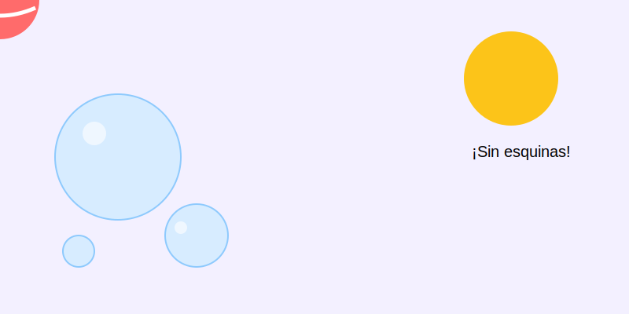

# Círculos Perfectos (o casi)

**Tiempo estimado**: 30 minutos  
**Nivel**: Básico (6+ años)  
**Prerrequisitos**: Haber hecho calistenia de brazo (garabatos).

---

## ¿Por qué el círculo es el Rey?

Mira a tu alrededor. El sol, la luna, los ojos, las ruedas, las galletas, las monedas... ¡El mundo está lleno de círculos! Si aprendes a dibujar un buen círculo, ya sabes dibujar la mitad del universo.

Pero cuidado: El círculo es caprichoso. Si te descuidas, se convierte en una papa o un huevo.

---

## El Secreto de los Artistas: Los 3 Motores

Tu brazo tiene tres "motores" para dibujar. El truco es saber cuál usar.

### 1. El Motor de la Muñeca (Círculos Pequeños)

* **Para qué sirve**: Para círculos chiquitos (como una moneda).
* **Cómo funciona**: Dejas la mano quieta apoyada en el papel y solo mueves la mano.
* **Ejemplo**: Dibujar ojos, uvas, botones.

### 2. El Motor del Codo (Círculos Medianos)

* **Para qué sirve**: Para círculos medianos (como una naranja).
* **Cómo funciona**: Levantas la muñeca y usas el codo como una bisagra. El antebrazo gira como las manecillas del reloj.

### 3. El Motor del Hombro (Círculos Gigantes)

* **Para qué sirve**: Para círculos grandes (como una cabeza o un balón).
* **Cómo funciona**: ¡Este es el secreto de los profesionales! Bloqueas la muñeca y el codo, y mueves TODO el brazo desde el hombro.
* **Ventaja**: Es la única forma de que un círculo grande salga redondo.

---

## Trucos para que salgan redondos

### Técnica 1. El Fantasma

Antes de tocar el papel, mueve el lápiz en círculos en el aire (encima de la hoja). Cuando sientas el movimiento seguro... ¡baja el lápiz suavemente!

### Técnica 2: La Velocidad

Si dibujas un círculo muy lento, tu mano tiembla y sale chueco.
Si lo dibujas un poco más rápido (¡swish!), la inercia ayuda a que salga redondo. ¡Confía en la velocidad!

### Técnica 3: No pares

No hagas el círculo por partes. Hazlo de un solo trazo continuo. Si no se cierra perfecto, no importa (puedes dar dos vueltas para corregir).

## Galería de Inspiración

