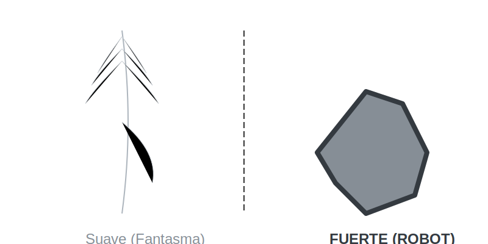

# Líneas Suaves y Fuertes (La Personalidad)

**Tiempo estimado**: 35 minutos  
**Nivel**: Básico-Intermedio (6+ años)  
**Prerrequisitos**: Controlar la presión (Tema anterior).

---

## No es lo mismo "Gordo" que "Fuerte"

En la lección pasada vimos líneas gordas y flacas. Hoy vamos a ver líneas **Suaaaaves** y **¡FUERTES!**.

* **Línea Suave**: Es como acariciar el papel. Se ve borrosa, como humo o nube.
* **Línea Fuerte**: Es como cortar el papel. Se ve nítida, rápida y peligrosa.

Este superpoder te sirve para dibujar **Texturas** (cómo se sienten las cosas).

---

## Cómo hacerlas

### 1. La Línea Fantasma (Suave)

Para hacer una línea que parece niebla:

* Agarra el lápiz desde **muy arriba** (lejos de la punta).
* Acuesta un poco el lápiz.
* Mueve la mano despacito.
* *Truco sucio*: Pasa tu dedo encima para borrarla un poquito.
* **Úsala para**: Nubes, fantasmas, pelo de gato, agua tranquila.

### 2. La Línea Rayo (Fuerte)

Para hacer una línea que parece metal:

* Agarra el lápiz cerca de la punta (como para escribir).
* ¡Zasss! Haz el trazo rápido. No dudes.
* Si dudas, la línea tiembla y pierde fuerza.
* **Úsala para**: Espadas, rocas, rayos, explosiones.

---

## El Juego de las Sensaciones

Tu dibujo puede transmitir sensaciones:

* Si dibujas una almohada con líneas fuertes y rectas... ¡parecerá una caja de piedra! (Ouch).
* Si dibujas una espada con líneas suaves y borrosas... ¡parecerá de algodón! (No corta nada).

**Regla de Oro**:

* Cosa Blanda -> Línea Suave.
* Cosa Dura -> Línea Fuerte.
