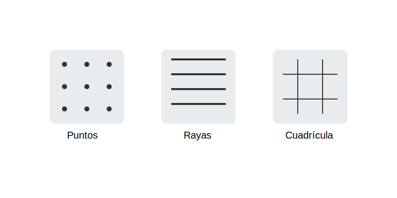

# Puntos, Rayas y Cuadrículas (El Alfabeto de las Texturas)

**Tiempo estimado**: 35 minutos  
**Nivel**: Básico-Intermedio (6+ años)  
**Prerrequisitos**: Saber hacer puntos y rayas.

---

## El Alfabeto Secreto del Dibujante

¿Sabías que con solo tres "letras" puedes dibujar cualquier textura del mundo?
Esas letras son:

1. **El Punto** (.)
2. **La Raya** (|)
3. **La Cuadrícula** (#)

Si aprendes a mezclarlas, puedes dibujar lluvia, arena, madera, ropa... ¡lo que sea!

---

## 1. El Poder del Punto (Punteado)

Imagina que la punta de tu lápiz es un pájaro picando alpiste.

* **Pocos puntos separados**: Luz, aire, nieve suave.
* **Muchos puntos juntos**: Sombra, arena, tierra, oscuridad.

**Regla de Oro**: ¡No arrastres el lápiz! Toca y levanta. Pic, pic, pic.

## 2. El Poder de la Raya (Rayado)

Las rayas nos dicen de qué está hecho algo.

* **Rayas rectas y ordenadas**: Paredes, cercas, lluvia.
* **Rayas curvas y locas**: Pelo, pasto, agua.

**Truco de Sombra**: Si pones muchas rayas juntas, creas oscuridad sin tener que pintar todo de negro.

## 3. El Poder de la Cuadrícula (Tramado)

Es como dibujar una red o una reja.

* Dibuja rayas verticales (|||).
* Dibuja rayas horizontales encima (===).
* ¡Listo! Tienes una textura de tela, canasta o ladrillos.

---

## ¿Para qué sirve esto?

Para no tener dibujos "aburridos" donde todo es blanco o rellenado de gris feo.
Las texturas hacen que tu dibujo se sienta real.

* ¿Dibujas una playa? ¡Llénala de puntitos!
* ¿Dibujas un bosque? ¡Llénalo de rayitas (pasto)!
