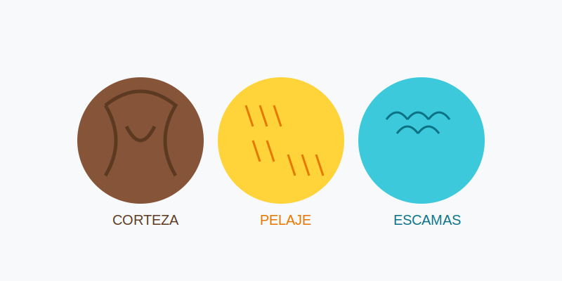

# Texturas de la Naturaleza (La Piel de las Cosas)

**Tiempo estimado**: 40 minutos  
**Nivel**: Intermedio (6+ años)  
**Prerrequisitos**: Puntos y Rayas.

---

## La Naturaleza no es Lisa

Mira a tu alrededor. Casi nada en la naturaleza es perfectamente liso como un espejo.

* Los árboles son rugosos.
* El agua se mueve.
* Las piedras tienen granitos.

Dibujar texturas es dibujar "cómo se siente" algo si lo tocas con los ojos cerrados.

---

## Las 3 Familias de Texturas

### 1. La Familia RUGOSA (Árboles y Piedras)

Son cosas duras y rasposas.

* **Piedras**: Usa líneas quebradas (zigzag) y puntos. *¡Clac, clac!*
* **Árboles**: Usa líneas verticales chuecas y nudos (círculos aplastados).

### 2. La Familia SUAVE (Pasto y Pelo)

Son cosas que se doblan si las tocas.

* **Pasto**: Haz rayitas rápidas hacia arriba (como la letra "v" o "i"). *¡Fush, fush!*
* **Pelo**: Igual que el pasto, pero siguiendo la forma del animal.

### 3. La Familia FLUIDA (Agua y Nubes)

Son cosas que no puedes agarrar.

* **Agua**: Líneas onduladas (~). Si está quieta, líneas largas. Si hay olas, líneas curvas.
* **Nubes**: Curvas suaves (burbujas) y líneas fantasmas (muy suaves).

---

## El Secreto del Mago: "NO Dibujes Todo"

Si dibujas un árbol... ¿tienes que dibujar el millón de hojas? ¡NO! Tardarías años.

* **El Truco**: Dibuja solo algunas hojas para dar la idea, y luego haz garabatos suaves para el resto.
* **El Cerebro Completa**: Si dibujas bien la textura en un pedacito, el cerebro imagina el resto.
