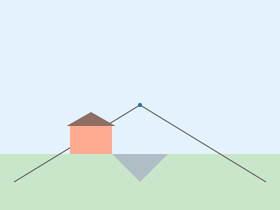
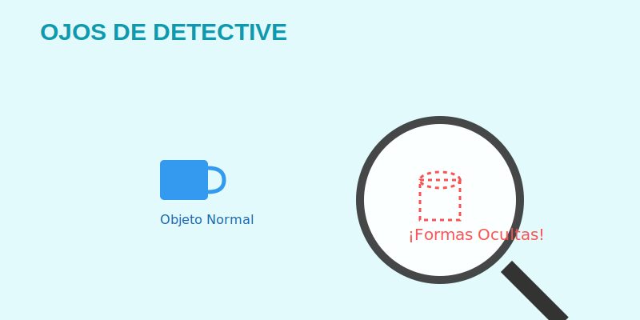

# Ojos de Detective (Aprender a Ver)

**Tiempo estimado**: 35 minutos  
**Nivel**: Intermedio (6+ años)  
**Prerrequisitos**: Ninguno (solo tus ojos y mucha curiosidad).

---

## 1. ¿Mirar o Ver? (El Superpoder del Artista)

Hay una diferencia gigante entre **Mirar** y **Observar**. La mayoría de las personas solo miran, pero los artistas observan.

* **Mirar 👁️**: Es rápido y superficial. "Ah, eso es un zapato". Tu cerebro le pone una etiqueta y sigue adelante.
* **Observar 🕵️**: Es lento y detallado. "Es un zapato azul desgastado, con agujetas blancas cruzadas, una mancha de lodo en la punta y la suela un poco chueca".

**Tu Misión**: Para dibujar bien, tienes que convertirte en un **Detective Visual**. No puedes adivinar cómo son las cosas; tienes que *investigarlas* con tus ojos hasta descubrir sus secretos.

---

## 2. El Cerebro es un "Mentiroso" (Eficiencia vs. Realidad)

Tu cerebro es increíble, pero también es un poco perezoso. Quiere trabajar poco para ahorrar energía.

Cuando ve un ojo, te dice: *"¡Rápido! Dibuja un símbolo de ojo (un círculo con un punto)"*.
¡Pero un ojo real no es así! Tiene forma de almendra, tiene párpados que lo cubren, tiene pestañas, tiene un brillo húmedo y el iris tiene texturas.

* Si le haces caso a tu **cerebro**, dibujas **símbolos** (como los emojis 😀).
* Si le haces caso a tus **ojos**, dibujas la **realidad**.

> **Preconcepto Clave**: **Simbolismo**. Los símbolos son dibujos simplificados que representan algo, pero no se parecen exactamente a la cosa real. Debemos aprender a "apagar" el modo símbolo.

---

## 3. Herramientas de Detective

### Herramienta 1: El Dibujo a Ciegas (Contorno Ciego)

Este es un juego divertido para "engañar" a tu cerebro lógico y obligarlo a observar.

1. Pon un objeto frente a ti (tu mano, una fruta, un juguete).
2. Pon el lápiz en el papel en una posición cómoda.
3. **¡REGLA DE ORO: NO MIRES EL PAPEL!** 🚫👀
4. Mira SOLO el objeto. Imagina que la punta de tu lápiz está tocando el objeto real.
5. Mueve tus ojos milímetro a milímetro por el borde del objeto, y mueve tu mano exactamente a la misma velocidad.
6. *No importa si el dibujo sale "feo" o deforme. ¡El objetivo es conectar tus ojos con tu mano!*

### Herramienta 2: Los Espacios Vacíos (El Espacio Negativo)

A veces es difícil dibujar una silla porque nuestro cerebro se confunde con tantas patas.
**Truco Maestro**: No dibujes la silla. **Dibuja los huecos de aire** que hay entre las patas.

Si te concentras en dibujar las formas de los huecos (que suelen ser triángulos o rectángulos simples), ¡la silla aparecerá mágicamente en medio! A esto los artistas lo llaman **Espacio Negativo**.

---

## 4. Entrenamiento Diario

¿Quieres ojos de artista? Practica esto:
Mira algo ordinario (tu mano, una hoja, un insecto) durante 1 minuto completo SIN hacer nada más. Busca **5 detalles secretos** que nadie más notaría (una pequeña arruga, un cambio de color, una sombra).

## Galería de Inspiración

