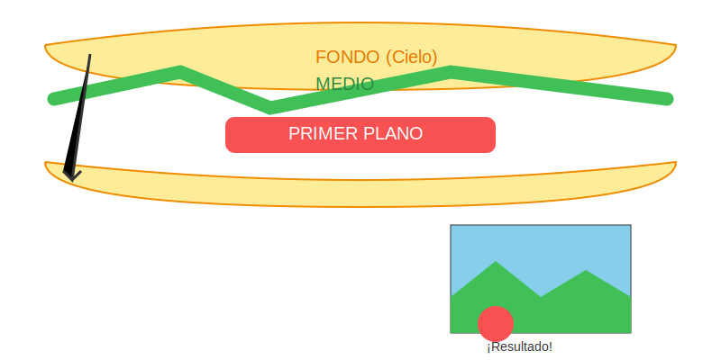

# Misión: El Sándwich Visual (Capas)

**Tiempo estimado**: 40 minutos  
**Nivel**: Intermedio  
**Prerrequisitos**: Uso del espacio.

---

## 1. El Mundo no es Plano

Tu hoja es plana (2D), pero el mundo real es profundo (3D).
¿Cómo metemos un mundo entero en una hoja delgada?
¡Haciendo un Sándwich de Realidad!

Imagina que tu dibujo tiene **3 Capas** transparentes:

### Capa 1. Primer Plano (Lo que puedes tocar) ✋

* **Posición**: Abajo de la hoja.
* **Tamaño**: GIGANTE.
* **Detalle**: Ves cada pelito, cada textura. Colores fuertes.
* **Ejemplo**: Una roca, un arbusto, tu propia mano.

### Capa 2: Plano Medio (La Historia) 🏃

* **Posición**: En el medio.
* **Tamaño**: Normal.
* **Detalle**: Aquí pasa la acción principal.
* **Ejemplo**: El caballo corriendo, la casa, el héroe.

### Capa 3: Fondo (El Decorado) 🏔️

* **Posición**: Arriba de la hoja.
* **Tamaño**: Diminuto (hormigas).
* **Detalle**: Borroso, colores suaves y azulados.
* **Ejemplo**: Montañas, sol, nubes, ciudades lejanas.

---

## 2. Superposición (El Secreto de Tapar)

En la vida real, las cosas se tapan unas a otras.
Si en tu dibujo separas al perro, al árbol y a la casa para que no se toquen... ¡se verá FALSO!

**Regla PRO**: Deja que el árbol (Primer Plano) tape un pedazo de la casa (Plano Medio). Y que la casa tape un pedazo de la montaña (Fondo).
¡Eso crea profundidad instantánea!
