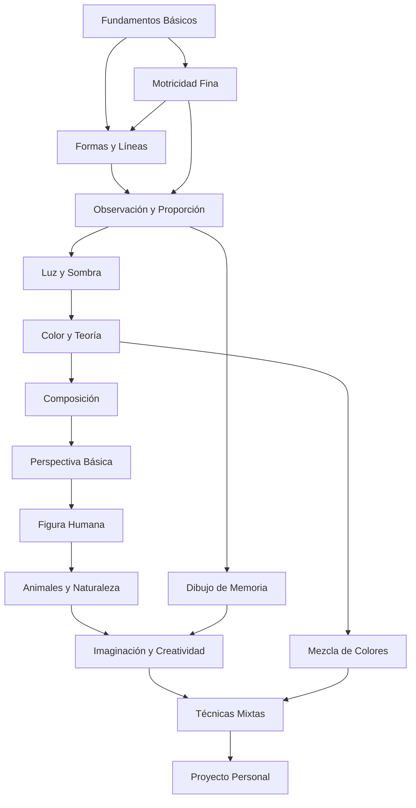

# ARQUITECTURA CURRICULAR: DIBUJO DE 0 A EXPERTO PARA NIÑOS

## METADATA

- **Complejidad**: Baja → Alta (Progresiva)
- **Duración estimada**: 120 horas totales
- **Audiencia objetivo**: Niños y niñas de 6 años en adelante
- **Prerrequisitos obligatorios**: Ninguno
- **Enfoque pedagógico**: Dibujo libre, creatividad, expresión artística
- **Fecha de diseño**: 2025-12-09

## MAPA CONCEPTUAL



## OBJETIVOS GENERALES DEL CURSO

1. **Desarrollar habilidades motoras finas** y coordinación ojo-mano mediante ejercicios progresivos de trazado y control del lápiz
2. **Comprender y aplicar fundamentos artísticos** (forma, línea, color, composición, perspectiva) adaptados a nivel infantil
3. **Estimular la creatividad y expresión personal** a través del dibujo libre y proyectos imaginativos
4. **Construir confianza artística** mediante logros graduales y retroalimentación positiva
5. **Desarrollar capacidad de observación** del entorno natural y artificial para representarlo gráficamente

## ESTRUCTURA MODULAR

### MÓDULO 0: Preparación y Descubrimiento Artístico

**Duración**: 6 horas  
**Objetivo**: Familiarizar al niño con materiales, desarrollar confianza inicial y establecer hábitos creativos

#### TEMA 0.1: Bienvenida al Mundo del Dibujo

**Objetivo del Tema**: Generar entusiasmo y eliminar el miedo al error

- **Subtema 0.1.1**: ¿Qué es el dibujo y por qué es divertido?
  - Objetivo: Comprender que el dibujo es una forma de expresión personal
  - Tipo: Teórico-Motivacional
  - Requiere Código: No

- **Subtema 0.1.2**: Conociendo nuestros materiales mágicos
  - Objetivo: Identificar y experimentar con lápices, crayones, marcadores y papel
  - Tipo: Práctica exploratoria
  - Requiere Código: No

#### TEMA 0.2: Primeros Trazos Libres

**Objetivo del Tema**: Desarrollar control motor básico sin presión técnica

- **Subtema 0.2.1**: Garabatos con propósito
  - Objetivo: Realizar trazos libres explorando presión y movimiento
  - Tipo: Práctica
  - Requiere Código: No

- **Subtema 0.2.2**: El juego de las líneas locas
  - Objetivo: Crear diferentes tipos de líneas (rectas, curvas, zigzag, espirales)
  - Tipo: Práctica lúdica
  - Requiere Código: No

---

### MÓDULO 1: Fundamentos de Formas Básicas

**Duración**: 10 horas  
**Objetivo**: Dominar el dibujo de formas geométricas simples como base de objetos complejos

#### TEMA 1.1: El Mundo de las Formas Simples

**Objetivo del Tema**: Reconocer y dibujar formas geométricas básicas

- **Subtema 1.1.1**: Círculos perfectos (o casi)
  - Objetivo: Dibujar círculos de diferentes tamaños con control progresivo
  - Tipo: Práctica técnica
  - Requiere Código: No

- **Subtema 1.1.2**: Cuadrados y rectángulos
  - Objetivo: Crear formas con ángulos rectos y lados paralelos
  - Tipo: Práctica técnica
  - Requiere Código: No

- **Subtema 1.1.3**: Triángulos de todos los tipos
  - Objetivo: Dibujar triángulos equiláteros, isósceles y escalenos
  - Tipo: Práctica técnica
  - Requiere Código: No

#### TEMA 1.2: Combinando Formas para Crear Objetos

**Objetivo del Tema**: Construir dibujos simples combinando formas básicas

- **Subtema 1.2.1**: Mi primera casa
  - Objetivo: Combinar cuadrado, triángulo y rectángulos para dibujar una casa
  - Tipo: Proyecto guiado
  - Requiere Código: No

- **Subtema 1.2.2**: Robots geométricos
  - Objetivo: Crear personajes usando solo formas geométricas
  - Tipo: Proyecto creativo
  - Requiere Código: No

- **Subtema 1.2.3**: Animales con formas simples
  - Objetivo: Dibujar animales básicos (pez, gato, pájaro) usando círculos y óvalos
  - Tipo: Proyecto guiado
  - Requiere Código: No

---

### MÓDULO 2: Control de Línea y Trazado

**Duración**: 12 horas  
**Objetivo**: Desarrollar precisión en el trazado y variedad de líneas expresivas

#### TEMA 2.1: Líneas con Personalidad

**Objetivo del Tema**: Crear diferentes tipos de líneas con intención expresiva

- **Subtema 2.1.1**: Líneas gruesas y delgadas
  - Objetivo: Controlar la presión del lápiz para variar el grosor
  - Tipo: Práctica técnica
  - Requiere Código: No

- **Subtema 2.1.2**: Líneas suaves y líneas fuertes
  - Objetivo: Expresar emociones mediante el tipo de trazo
  - Tipo: Práctica expresiva
  - Requiere Código: No

- **Subtema 2.1.3**: Líneas que cuentan historias
  - Objetivo: Usar diferentes líneas para representar texturas (pelo, agua, pasto)
  - Tipo: Práctica aplicada
  - Requiere Código: No

#### TEMA 2.2: Patrones y Texturas

**Objetivo del Tema**: Crear rellenos visuales mediante patrones repetitivos

- **Subtema 2.2.1**: Puntos, rayas y cuadrículas
  - Objetivo: Rellenar áreas con patrones básicos
  - Tipo: Práctica técnica
  - Requiere Código: No

- **Subtema 2.2.2**: Texturas de la naturaleza
  - Objetivo: Representar corteza de árbol, escamas, plumas
  - Tipo: Práctica observacional
  - Requiere Código: No

---

### MÓDULO 3: Observación y Dibujo del Natural

**Duración**: 14 horas  
**Objetivo**: Desarrollar habilidad de observación para dibujar objetos reales

#### TEMA 3.1: Aprendiendo a Ver como Artistas

**Objetivo del Tema**: Entrenar la observación detallada de objetos

- **Subtema 3.1.1**: El juego de las diferencias
  - Objetivo: Identificar detalles en objetos cotidianos
  - Tipo: Ejercicio perceptivo
  - Requiere Código: No

- **Subtema 3.1.2**: Dibujando mi juguete favorito
  - Objetivo: Reproducir un objeto tridimensional en papel
  - Tipo: Práctica observacional
  - Requiere Código: No

- **Subtema 3.1.3**: Frutas y verduras
  - Objetivo: Dibujar formas orgánicas observando el modelo real
  - Tipo: Práctica del natural
  - Requiere Código: No

#### TEMA 3.2: Proporciones Básicas

**Objetivo del Tema**: Comprender relaciones de tamaño entre partes

- **Subtema 3.2.1**: Grande, mediano y pequeño
  - Objetivo: Comparar tamaños relativos en un dibujo
  - Tipo: Práctica técnica
  - Requiere Código: No

- **Subtema 3.2.2**: La regla del pulgar (medición visual)
  - Objetivo: Usar técnicas simples para medir proporciones
  - Tipo: Práctica técnica
  - Requiere Código: No

---

### MÓDULO 4: Introducción al Color

**Duración**: 12 horas  
**Objetivo**: Comprender teoría básica del color y aplicarla creativamente

#### TEMA 4.1: El Círculo Cromático Mágico

**Objetivo del Tema**: Conocer colores primarios, secundarios y complementarios

- **Subtema 4.1.1**: Los tres colores mágicos (primarios)
  - Objetivo: Identificar rojo, amarillo y azul como base de todos los colores
  - Tipo: Teórico-práctico
  - Requiere Código: No

- **Subtema 4.1.2**: Mezclando colores nuevos (secundarios)
  - Objetivo: Crear naranja, verde y violeta mediante mezclas
  - Tipo: Práctica experimental
  - Requiere Código: No

- **Subtema 4.1.3**: Colores que se llevan bien (armonías)
  - Objetivo: Combinar colores que se ven bonitos juntos
  - Tipo: Práctica compositiva
  - Requiere Código: No

#### TEMA 4.2: Colores Cálidos y Fríos

**Objetivo del Tema**: Usar temperatura del color para expresar emociones

- **Subtema 4.2.1**: El sol y el fuego (colores cálidos)
  - Objetivo: Crear dibujos usando solo rojos, naranjas y amarillos
  - Tipo: Proyecto temático
  - Requiere Código: No

- **Subtema 4.2.2**: El mar y el cielo (colores fríos)
  - Objetivo: Crear dibujos usando solo azules, verdes y violetas
  - Tipo: Proyecto temático
  - Requiere Código: No

---

### MÓDULO 5: Luz, Sombra y Volumen

**Duración**: 10 horas  
**Objetivo**: Dar tridimensionalidad a los dibujos mediante sombreado

#### TEMA 5.1: De lo Plano a lo Redondo

**Objetivo del Tema**: Comprender cómo la luz crea volumen

- **Subtema 5.1.1**: ¿De dónde viene la luz?
  - Objetivo: Identificar fuentes de luz en objetos reales
  - Tipo: Ejercicio observacional
  - Requiere Código: No

- **Subtema 5.1.2**: Sombreando una esfera
  - Objetivo: Crear degradado de luz a sombra en forma circular
  - Tipo: Práctica técnica
  - Requiere Código: No

- **Subtema 5.1.3**: Sombras proyectadas
  - Objetivo: Dibujar la sombra que un objeto hace en el suelo
  - Tipo: Práctica técnica
  - Requiere Código: No

#### TEMA 5.2: Técnicas de Sombreado

**Objetivo del Tema**: Aplicar diferentes métodos de sombreado

- **Subtema 5.2.1**: Sombreado con líneas (rayado)
  - Objetivo: Crear tonos mediante líneas paralelas
  - Tipo: Práctica técnica
  - Requiere Código: No

- **Subtema 5.2.2**: Sombreado difuminado
  - Objetivo: Crear transiciones suaves con el dedo o difumino
  - Tipo: Práctica técnica
  - Requiere Código: No

---

### MÓDULO 6: Composición y Diseño

**Duración**: 10 horas  
**Objetivo**: Organizar elementos en el espacio del papel de forma equilibrada

#### TEMA 6.1: El Espacio del Papel

**Objetivo del Tema**: Usar todo el espacio disponible de forma intencional

- **Subtema 6.1.1**: Arriba, abajo, centro
  - Objetivo: Colocar elementos en diferentes zonas del papel
  - Tipo: Ejercicio compositivo
  - Requiere Código: No

- **Subtema 6.1.2**: Primer plano y fondo
  - Objetivo: Crear profundidad mediante superposición
  - Tipo: Práctica técnica
  - Requiere Código: No

#### TEMA 6.2: Equilibrio Visual

**Objetivo del Tema**: Distribuir elementos para crear armonía

- **Subtema 6.2.1**: Simetría y asimetría
  - Objetivo: Crear composiciones balanceadas de ambos tipos
  - Tipo: Práctica compositiva
  - Requiere Código: No

- **Subtema 6.2.2**: El punto focal (¿dónde miran primero?)
  - Objetivo: Dirigir la atención del espectador
  - Tipo: Práctica compositiva
  - Requiere Código: No

---

### MÓDULO 7: Perspectiva Básica

**Duración**: 8 horas  
**Objetivo**: Representar profundidad y espacio tridimensional

#### TEMA 7.1: Cosas Cerca y Cosas Lejos

**Objetivo del Tema**: Comprender que los objetos lejanos se ven más pequeños

- **Subtema 7.1.1**: El camino que se hace chiquito
  - Objetivo: Dibujar un camino con perspectiva simple
  - Tipo: Práctica técnica
  - Requiere Código: No

- **Subtema 7.1.2**: Casas en la distancia
  - Objetivo: Aplicar reducción de tamaño para crear profundidad
  - Tipo: Proyecto guiado
  - Requiere Código: No

#### TEMA 7.2: La Línea del Horizonte

**Objetivo del Tema**: Usar la línea del horizonte como referencia

- **Subtema 7.2.1**: Cielo y tierra
  - Objetivo: Dividir el espacio en planos horizontales
  - Tipo: Práctica técnica
  - Requiere Código: No

- **Subtema 7.2.2**: Perspectiva de un punto (la calle)
  - Objetivo: Dibujar objetos convergiendo hacia un punto de fuga
  - Tipo: Práctica técnica avanzada
  - Requiere Código: No

---

### MÓDULO 8: Figura Humana Simplificada

**Duración**: 12 horas  
**Objetivo**: Dibujar personas usando proporciones básicas y formas simples

#### TEMA 8.1: El Muñeco de Palitos Evolucionado

**Objetivo del Tema**: Construir figuras humanas con estructura básica

- **Subtema 8.1.1**: Cabeza, tronco y extremidades
  - Objetivo: Dibujar figura humana con proporciones infantiles simples
  - Tipo: Práctica técnica
  - Requiere Código: No

- **Subtema 8.1.2**: Poses y movimiento
  - Objetivo: Representar figuras en diferentes acciones (corriendo, saltando)
  - Tipo: Práctica dinámica
  - Requiere Código: No

#### TEMA 8.2: Rostros Expresivos

**Objetivo del Tema**: Dibujar caras con diferentes emociones

- **Subtema 8.2.1**: Feliz, triste, enojado, sorprendido
  - Objetivo: Modificar ojos y boca para expresar emociones
  - Tipo: Práctica expresiva
  - Requiere Código: No

- **Subtema 8.2.2**: Mi autorretrato
  - Objetivo: Dibujar el propio rostro observándose en espejo
  - Tipo: Proyecto personal
  - Requiere Código: No

---

### MÓDULO 9: Animales y Naturaleza

**Duración**: 10 horas  
**Objetivo**: Representar seres vivos y elementos naturales

#### TEMA 9.1: Animales Favoritos

**Objetivo del Tema**: Dibujar animales comunes con formas simplificadas

- **Subtema 9.1.1**: Mascotas (perro, gato, conejo)
  - Objetivo: Capturar características distintivas de cada animal
  - Tipo: Práctica observacional
  - Requiere Código: No

- **Subtema 9.1.2**: Animales salvajes (león, elefante, jirafa)
  - Objetivo: Dibujar animales con proporciones características
  - Tipo: Práctica guiada
  - Requiere Código: No

#### TEMA 9.2: Paisajes Naturales

**Objetivo del Tema**: Componer escenas de naturaleza

- **Subtema 9.2.1**: Árboles de diferentes tipos
  - Objetivo: Representar árboles con texturas y formas variadas
  - Tipo: Práctica técnica
  - Requiere Código: No

- **Subtema 9.2.2**: Mi paisaje imaginario
  - Objetivo: Crear un paisaje completo combinando elementos aprendidos
  - Tipo: Proyecto creativo
  - Requiere Código: No

---

### MÓDULO 10: Imaginación y Creatividad Avanzada

**Duración**: 10 horas  
**Objetivo**: Desarrollar estilo personal y narrativa visual

#### TEMA 10.1: Criaturas Fantásticas

**Objetivo del Tema**: Inventar seres originales combinando elementos reales

- **Subtema 10.1.1**: Mi dragón único
  - Objetivo: Diseñar un dragón con características personalizadas
  - Tipo: Proyecto creativo
  - Requiere Código: No

- **Subtema 10.1.2**: Híbridos imposibles
  - Objetivo: Combinar partes de diferentes animales
  - Tipo: Proyecto imaginativo
  - Requiere Código: No

#### TEMA 10.2: Mundos Inventados

**Objetivo del Tema**: Crear escenarios de fantasía

- **Subtema 10.2.1**: Mi planeta extraño
  - Objetivo: Diseñar un mundo con reglas visuales propias
  - Tipo: Proyecto narrativo
  - Requiere Código: No

- **Subtema 10.2.2**: La ciudad del futuro
  - Objetivo: Imaginar arquitectura y tecnología futurista
  - Tipo: Proyecto creativo
  - Requiere Código: No

---

### MÓDULO 11: Técnicas Mixtas y Experimentación

**Duración**: 8 horas  
**Objetivo**: Combinar diferentes materiales y técnicas

#### TEMA 11.1: Más Allá del Lápiz

**Objetivo del Tema**: Explorar materiales diversos

- **Subtema 11.1.1**: Acuarelas y crayones juntos
  - Objetivo: Crear efectos combinando técnicas húmedas y secas
  - Tipo: Práctica experimental
  - Requiere Código: No

- **Subtema 11.1.2**: Collage y dibujo
  - Objetivo: Integrar papeles recortados con dibujo
  - Tipo: Práctica mixta
  - Requiere Código: No

#### TEMA 11.2: Texturas Reales

**Objetivo del Tema**: Incorporar materiales no convencionales

- **Subtema 11.2.1**: Frotado de texturas
  - Objetivo: Capturar texturas reales mediante frotado
  - Tipo: Práctica experimental
  - Requiere Código: No

- **Subtema 11.2.2**: Arena, tela y otros materiales
  - Objetivo: Crear obras con elementos tridimensionales
  - Tipo: Proyecto mixto
  - Requiere Código: No

---

### MÓDULO 12: Proyecto Personal Final

**Duración**: 8 horas  
**Objetivo**: Crear una obra completa que demuestre todo lo aprendido

#### TEMA 12.1: Planificación del Proyecto

**Objetivo del Tema**: Diseñar un proyecto artístico personal

- **Subtema 12.1.1**: Eligiendo mi tema favorito
  - Objetivo: Seleccionar un tema significativo para el proyecto final
  - Tipo: Planificación creativa
  - Requiere Código: No

- **Subtema 12.1.2**: Bocetos y pruebas
  - Objetivo: Experimentar con diferentes composiciones
  - Tipo: Desarrollo de proyecto
  - Requiere Código: No

#### TEMA 12.2: Ejecución y Presentación

**Objetivo del Tema**: Completar y compartir la obra final

- **Subtema 12.2.1**: Creando mi obra maestra
  - Objetivo: Ejecutar el proyecto aplicando técnicas aprendidas
  - Tipo: Proyecto integrador
  - Requiere Código: No

- **Subtema 12.2.2**: Presentando mi trabajo
  - Objetivo: Explicar decisiones artísticas y proceso creativo
  - Tipo: Reflexión y comunicación
  - Requiere Código: No

---

## RECURSOS TÉCNICOS REQUERIDOS

### Para el estudiante

**Materiales básicos:**

- Lápices grafito (HB, 2B, 4B)
- Goma de borrar blanca
- Sacapuntas
- Papel bond blanco (tamaño carta/A4)
- Crayones de cera (caja de 12-24 colores)
- Marcadores de colores (punta fina y gruesa)
- Lápices de colores (caja de 12-24 colores)

**Materiales intermedios:**

- Acuarelas (paleta básica de 12 colores)
- Pinceles (redondos #2, #6, #10)
- Papel para acuarela (200g/m²)
- Carboncillo
- Difuminos o tortillones
- Regla de 30cm

**Materiales avanzados:**

- Pasteles secos
- Tinta china
- Plumillas
- Papeles de colores
- Pegamento
- Tijeras de seguridad

**Espacio de trabajo:**

- Mesa con buena iluminación
- Superficie protegida (mantel plástico)
- Recipiente para agua
- Trapos o toallas de papel

### Para el instructor/plataforma

- **Galería de ejemplos**: Banco de imágenes de referencia por módulo
- **Videos demostrativos**: Grabaciones de técnicas paso a paso
- **Sistema de portafolio digital**: Para que niños suban fotos de sus trabajos
- **Plantillas descargables**: Guías de proporción, círculos cromáticos, etc.
- **Retroalimentación visual**: Herramienta para marcar y comentar sobre imágenes

---

## PLAN DE ACTUALIZACIÓN

- **Vigencia estimada**: 3-5 años (fundamentos artísticos son atemporales)
- **Puntos de actualización**:
  - Incorporar herramientas digitales básicas (apps de dibujo para tablets) como módulo opcional
  - Actualizar referencias visuales con personajes/temas contemporáneos
  - Expandir sección de técnicas mixtas según nuevos materiales disponibles
- **Estrategia de mantenimiento**: Revisión anual de ejemplos y ejercicios, actualización semestral de galería de trabajos estudiantiles

---

## MATRIZ DE TRAZABILIDAD

| Módulo | Conceptos Clave | Objetivos Bloom | Evaluaciones | Tiempo (h) |
|--------|----------------|-----------------|--------------|------------|
| 0 | Familiarización, confianza | Recordar, Comprender | Diagnóstica | 6 |
| 1 | Formas geométricas | Aplicar | Formativa | 10 |
| 2 | Control de línea | Aplicar | Formativa | 12 |
| 3 | Observación | Analizar | Formativa | 14 |
| 4 | Teoría del color | Comprender, Aplicar | Formativa | 12 |
| 5 | Luz y sombra | Aplicar, Analizar | Formativa | 10 |
| 6 | Composición | Analizar, Evaluar | Formativa | 10 |
| 7 | Perspectiva | Aplicar | Formativa | 8 |
| 8 | Figura humana | Aplicar | Formativa | 12 |
| 9 | Naturaleza | Aplicar, Crear | Formativa | 10 |
| 10 | Creatividad | Crear | Formativa | 10 |
| 11 | Técnicas mixtas | Crear | Formativa | 8 |
| 12 | Proyecto final | Crear, Evaluar | Sumativa | 8 |
| **TOTAL** | **13 módulos** | **Progresión completa** | **13** | **120** |

---

## ALERTAS Y CONSIDERACIONES

### Cuellos de botella identificados

1. **Módulo 3 (Observación)**: Niños pequeños pueden frustrarse al no lograr "realismo". Requiere énfasis en que cada interpretación es válida.
2. **Módulo 5 (Sombreado)**: Técnica que requiere paciencia y control motor fino. Puede necesitar más tiempo de práctica.
3. **Módulo 7 (Perspectiva)**: Concepto abstracto para menores de 8 años. Simplificar al máximo y usar ejemplos muy concretos.

### Estrategias de mitigación

- **Refuerzo positivo constante**: Celebrar el esfuerzo, no solo el resultado
- **Ejemplos diversos**: Mostrar que no hay "una forma correcta" de dibujar
- **Ejercicios cortos**: Sesiones de 15-20 minutos para mantener atención
- **Juegos y narrativas**: Convertir ejercicios técnicos en actividades lúdicas
- **Flexibilidad temporal**: Permitir que cada niño avance a su ritmo

### Flexibilidad del plan

- **Módulos 10-11 son intercambiables**: Pueden reordenarse según interés del grupo
- **Módulo 0 puede extenderse**: Si el grupo necesita más tiempo de familiarización
- **Módulos 7-8 pueden simplificarse**: Para grupos de 6-7 años, reducir complejidad técnica
- **Proyectos intermedios opcionales**: Pueden insertarse mini-proyectos entre módulos según motivación

---

## DIFERENCIACIÓN POR EDAD

### Grupo 6-8 años (Ruta Básica)

- Énfasis en exploración y juego
- Ejercicios más cortos (10-15 min)
- Menos énfasis en técnica, más en expresión
- Módulos 7 y 8 muy simplificados
- Duración total: 80-90 horas

### Grupo 9-11 años (Ruta Intermedia)

- Balance entre técnica y creatividad
- Ejercicios de 20-30 minutos
- Introducción gradual de conceptos técnicos
- Todos los módulos con complejidad estándar
- Duración total: 100-110 horas

### Grupo 12+ años (Ruta Avanzada)

- Mayor énfasis en técnica y fundamentos
- Ejercicios de 30-45 minutos
- Profundización en perspectiva y anatomía
- Módulos adicionales opcionales (anatomía avanzada, estilos artísticos)
- Duración total: 120-140 horas

---

## ESTRUCTURA CURRICULAR JSON

```json
[
  {
    "modulo_id": 0,
    "titulo": "Preparación y Descubrimiento Artístico",
    "temas": [
      {
        "tema_id": "0.1",
        "titulo": "Bienvenida al Mundo del Dibujo",
        "subtemas": [
          {
            "subtema_id": "0.1.1",
            "titulo": "¿Qué es el dibujo y por qué es divertido?"
          },
          {
            "subtema_id": "0.1.2",
            "titulo": "Conociendo nuestros materiales mágicos"
          }
        ]
      },
      {
        "tema_id": "0.2",
        "titulo": "Primeros Trazos Libres",
        "subtemas": [
          {
            "subtema_id": "0.2.1",
            "titulo": "Garabatos con propósito"
          },
          {
            "subtema_id": "0.2.2",
            "titulo": "El juego de las líneas locas"
          }
        ]
      }
    ]
  },
  {
    "modulo_id": 1,
    "titulo": "Fundamentos de Formas Básicas",
    "temas": [
      {
        "tema_id": "1.1",
        "titulo": "El Mundo de las Formas Simples",
        "subtemas": [
          {
            "subtema_id": "1.1.1",
            "titulo": "Círculos perfectos (o casi)"
          },
          {
            "subtema_id": "1.1.2",
            "titulo": "Cuadrados y rectángulos"
          },
          {
            "subtema_id": "1.1.3",
            "titulo": "Triángulos de todos los tipos"
          }
        ]
      },
      {
        "tema_id": "1.2",
        "titulo": "Combinando Formas para Crear Objetos",
        "subtemas": [
          {
            "subtema_id": "1.2.1",
            "titulo": "Mi primera casa"
          },
          {
            "subtema_id": "1.2.2",
            "titulo": "Robots geométricos"
          },
          {
            "subtema_id": "1.2.3",
            "titulo": "Animales con formas simples"
          }
        ]
      }
    ]
  },
  {
    "modulo_id": 2,
    "titulo": "Control de Línea y Trazado",
    "temas": [
      {
        "tema_id": "2.1",
        "titulo": "Líneas con Personalidad",
        "subtemas": [
          {
            "subtema_id": "2.1.1",
            "titulo": "Líneas gruesas y delgadas"
          },
          {
            "subtema_id": "2.1.2",
            "titulo": "Líneas suaves y líneas fuertes"
          },
          {
            "subtema_id": "2.1.3",
            "titulo": "Líneas que cuentan historias"
          }
        ]
      },
      {
        "tema_id": "2.2",
        "titulo": "Patrones y Texturas",
        "subtemas": [
          {
            "subtema_id": "2.2.1",
            "titulo": "Puntos, rayas y cuadrículas"
          },
          {
            "subtema_id": "2.2.2",
            "titulo": "Texturas de la naturaleza"
          }
        ]
      }
    ]
  },
  {
    "modulo_id": 3,
    "titulo": "Observación y Dibujo del Natural",
    "temas": [
      {
        "tema_id": "3.1",
        "titulo": "Aprendiendo a Ver como Artistas",
        "subtemas": [
          {
            "subtema_id": "3.1.1",
            "titulo": "El juego de las diferencias"
          },
          {
            "subtema_id": "3.1.2",
            "titulo": "Dibujando mi juguete favorito"
          },
          {
            "subtema_id": "3.1.3",
            "titulo": "Frutas y verduras"
          }
        ]
      },
      {
        "tema_id": "3.2",
        "titulo": "Proporciones Básicas",
        "subtemas": [
          {
            "subtema_id": "3.2.1",
            "titulo": "Grande, mediano y pequeño"
          },
          {
            "subtema_id": "3.2.2",
            "titulo": "La regla del pulgar (medición visual)"
          }
        ]
      }
    ]
  },
  {
    "modulo_id": 4,
    "titulo": "Introducción al Color",
    "temas": [
      {
        "tema_id": "4.1",
        "titulo": "El Círculo Cromático Mágico",
        "subtemas": [
          {
            "subtema_id": "4.1.1",
            "titulo": "Los tres colores mágicos (primarios)"
          },
          {
            "subtema_id": "4.1.2",
            "titulo": "Mezclando colores nuevos (secundarios)"
          },
          {
            "subtema_id": "4.1.3",
            "titulo": "Colores que se llevan bien (armonías)"
          }
        ]
      },
      {
        "tema_id": "4.2",
        "titulo": "Colores Cálidos y Fríos",
        "subtemas": [
          {
            "subtema_id": "4.2.1",
            "titulo": "El sol y el fuego (colores cálidos)"
          },
          {
            "subtema_id": "4.2.2",
            "titulo": "El mar y el cielo (colores fríos)"
          }
        ]
      }
    ]
  },
  {
    "modulo_id": 5,
    "titulo": "Luz, Sombra y Volumen",
    "temas": [
      {
        "tema_id": "5.1",
        "titulo": "De lo Plano a lo Redondo",
        "subtemas": [
          {
            "subtema_id": "5.1.1",
            "titulo": "¿De dónde viene la luz?"
          },
          {
            "subtema_id": "5.1.2",
            "titulo": "Sombreando una esfera"
          },
          {
            "subtema_id": "5.1.3",
            "titulo": "Sombras proyectadas"
          }
        ]
      },
      {
        "tema_id": "5.2",
        "titulo": "Técnicas de Sombreado",
        "subtemas": [
          {
            "subtema_id": "5.2.1",
            "titulo": "Sombreado con líneas (rayado)"
          },
          {
            "subtema_id": "5.2.2",
            "titulo": "Sombreado difuminado"
          }
        ]
      }
    ]
  },
  {
    "modulo_id": 6,
    "titulo": "Composición y Diseño",
    "temas": [
      {
        "tema_id": "6.1",
        "titulo": "El Espacio del Papel",
        "subtemas": [
          {
            "subtema_id": "6.1.1",
            "titulo": "Arriba, abajo, centro"
          },
          {
            "subtema_id": "6.1.2",
            "titulo": "Primer plano y fondo"
          }
        ]
      },
      {
        "tema_id": "6.2",
        "titulo": "Equilibrio Visual",
        "subtemas": [
          {
            "subtema_id": "6.2.1",
            "titulo": "Simetría y asimetría"
          },
          {
            "subtema_id": "6.2.2",
            "titulo": "El punto focal (¿dónde miran primero?)"
          }
        ]
      }
    ]
  },
  {
    "modulo_id": 7,
    "titulo": "Perspectiva Básica",
    "temas": [
      {
        "tema_id": "7.1",
        "titulo": "Cosas Cerca y Cosas Lejos",
        "subtemas": [
          {
            "subtema_id": "7.1.1",
            "titulo": "El camino que se hace chiquito"
          },
          {
            "subtema_id": "7.1.2",
            "titulo": "Casas en la distancia"
          }
        ]
      },
      {
        "tema_id": "7.2",
        "titulo": "La Línea del Horizonte",
        "subtemas": [
          {
            "subtema_id": "7.2.1",
            "titulo": "Cielo y tierra"
          },
          {
            "subtema_id": "7.2.2",
            "titulo": "Perspectiva de un punto (la calle)"
          }
        ]
      }
    ]
  },
  {
    "modulo_id": 8,
    "titulo": "Figura Humana Simplificada",
    "temas": [
      {
        "tema_id": "8.1",
        "titulo": "El Muñeco de Palitos Evolucionado",
        "subtemas": [
          {
            "subtema_id": "8.1.1",
            "titulo": "Cabeza, tronco y extremidades"
          },
          {
            "subtema_id": "8.1.2",
            "titulo": "Poses y movimiento"
          }
        ]
      },
      {
        "tema_id": "8.2",
        "titulo": "Rostros Expresivos",
        "subtemas": [
          {
            "subtema_id": "8.2.1",
            "titulo": "Feliz, triste, enojado, sorprendido"
          },
          {
            "subtema_id": "8.2.2",
            "titulo": "Mi autorretrato"
          }
        ]
      }
    ]
  },
  {
    "modulo_id": 9,
    "titulo": "Animales y Naturaleza",
    "temas": [
      {
        "tema_id": "9.1",
        "titulo": "Animales Favoritos",
        "subtemas": [
          {
            "subtema_id": "9.1.1",
            "titulo": "Mascotas (perro, gato, conejo)"
          },
          {
            "subtema_id": "9.1.2",
            "titulo": "Animales salvajes (león, elefante, jirafa)"
          }
        ]
      },
      {
        "tema_id": "9.2",
        "titulo": "Paisajes Naturales",
        "subtemas": [
          {
            "subtema_id": "9.2.1",
            "titulo": "Árboles de diferentes tipos"
          },
          {
            "subtema_id": "9.2.2",
            "titulo": "Mi paisaje imaginario"
          }
        ]
      }
    ]
  },
  {
    "modulo_id": 10,
    "titulo": "Imaginación y Creatividad Avanzada",
    "temas": [
      {
        "tema_id": "10.1",
        "titulo": "Criaturas Fantásticas",
        "subtemas": [
          {
            "subtema_id": "10.1.1",
            "titulo": "Mi dragón único"
          },
          {
            "subtema_id": "10.1.2",
            "titulo": "Híbridos imposibles"
          }
        ]
      },
      {
        "tema_id": "10.2",
        "titulo": "Mundos Inventados",
        "subtemas": [
          {
            "subtema_id": "10.2.1",
            "titulo": "Mi planeta extraño"
          },
          {
            "subtema_id": "10.2.2",
            "titulo": "La ciudad del futuro"
          }
        ]
      }
    ]
  },
  {
    "modulo_id": 11,
    "titulo": "Técnicas Mixtas y Experimentación",
    "temas": [
      {
        "tema_id": "11.1",
        "titulo": "Más Allá del Lápiz",
        "subtemas": [
          {
            "subtema_id": "11.1.1",
            "titulo": "Acuarelas y crayones juntos"
          },
          {
            "subtema_id": "11.1.2",
            "titulo": "Collage y dibujo"
          }
        ]
      },
      {
        "tema_id": "11.2",
        "titulo": "Texturas Reales",
        "subtemas": [
          {
            "subtema_id": "11.2.1",
            "titulo": "Frotado de texturas"
          },
          {
            "subtema_id": "11.2.2",
            "titulo": "Arena, tela y otros materiales"
          }
        ]
      }
    ]
  },
  {
    "modulo_id": 12,
    "titulo": "Proyecto Personal Final",
    "temas": [
      {
        "tema_id": "12.1",
        "titulo": "Planificación del Proyecto",
        "subtemas": [
          {
            "subtema_id": "12.1.1",
            "titulo": "Eligiendo mi tema favorito"
          },
          {
            "subtema_id": "12.1.2",
            "titulo": "Bocetos y pruebas"
          }
        ]
      },
      {
        "tema_id": "12.2",
        "titulo": "Ejecución y Presentación",
        "subtemas": [
          {
            "subtema_id": "12.2.1",
            "titulo": "Creando mi obra maestra"
          },
          {
            "subtema_id": "12.2.2",
            "titulo": "Presentando mi trabajo"
          }
        ]
      }
    ]
  }
]
```
